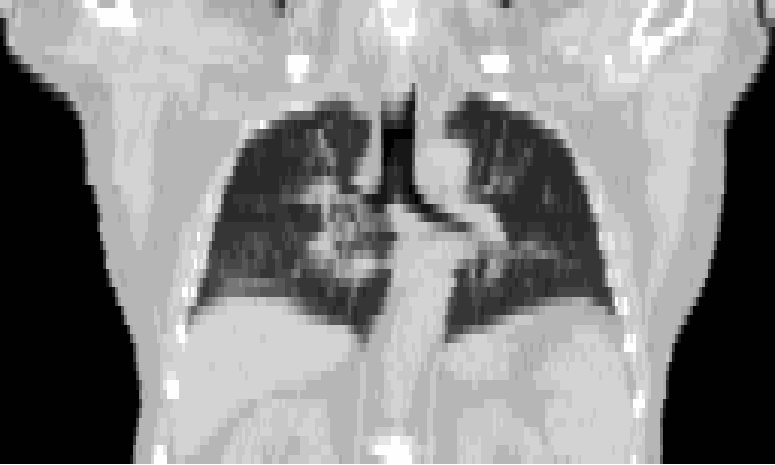

# Synthesis of respiratory motion in CT images using latent diffusion models



This repository contains code for data processing, training, and inference of the latent diffusion models used in *Synthesis of respiratory motion in CT images using latent diffusion models*, submitted to SPIE Medical Imaging 2026 (under review). 

- [Synthesis of respiratory motion in CT images using latent diffusion models](#synthesis-of-respiratory-motion-in-ct-images-using-latent-diffusion-models)
  - [Dataset information](#dataset-information)
  - [Setting up](#setting-up)
  - [Data processing](#data-processing)
  - [Inference](#inference)
    - [Using pretrained models](#using-pretrained-models)
      - [Downloading model weights](#downloading-model-weights)
    - [Running inference to generate GIFs of motion](#running-inference-to-generate-gifs-of-motion)
  - [Training](#training)
    - [Training autoencoders](#training-autoencoders)
    - [Training diffusion models](#training-diffusion-models)
    - [Using Tensorboard to inspect training runs](#using-tensorboard-to-inspect-training-runs)


## Dataset information
We use the [4D-Lung dataset](https://www.cancerimagingarchive.net/collection/4d-lung/) provided by The Cancer Imaging Archive (TCIA). This dataset contains a total of 588 studies from 20 patients; we remove 3 non-conforming studies for a total of 585 studies in our dataset. Each study contains 10 volumes corresponding to phases of the breathing cycle, with the first phase taken at the EOI phase, and the middle phase EOE. We downsample volumes to 50x256x256, giving a total of 29250 slices per breathing phase. 


## Setting up
To set up, simply run `bash setup.sh`. This will automatically install all requirements. You may optionally want to run `pip install -e . ` which lets you work on code in your project root and import it from anywhere. 

Once you have run the setup, you can reactivate your virtual environment by running `source .venv/bin/activate`. 

## Data processing

Follow these steps to download and process the data: 
1. Download and process the data into downsampled volumes. This can be done by running `python data_processing/download_idc.py`. You can pass `--target_vol_dimensions` to downsample differently; our results are from sampling to 50x256x256, which is the default. We also recommend passing `--end n` to only get a subset of the data; e.g. 10 studies for `--end 10`. This reduces download and processing times significantly since there will be a lot less data.  
2. Generate B-spline transforms. This can be done by running `python data_processing/create_bsplines.py`. For further information on parameters used, peruse that file and the Airlab documentation. This processing step takes about 4 hours on an A100 GPU for the complete dataset. The B-spline transforms take up much less storage space than the dense DVFs used in training, and are transformed into DVFs during data loading. We do not host a mirror of preprocessed data since it is ~160GB in total. 
3. (For diffusion training) generate a latent dataset. This is done by running `python data_processing/create_latent_set.py`. It will use the autoencoder paths in the `"latent_diffusion"` key of `paths.json` to generate the dataset. This takes about 30 minutes on an A100 - distributed processing of the latent dataset using multiple GPUs is not yet supported. 

## Inference 
### Using pretrained models 
#### Downloading model weights
Model weights are available [here](https://huggingface.co/Axreub/respiratory-motion-ldm). Once downloaded, set the following in `paths.json`:

``` json
    "inference": {
        "latent_diffusion": {
            "image_autoencoder_path": "path_to_models/image_autoenc/model.pt",
            "dvf_autoencoder_path": "path_to_models/dvf_vae/vae.pt",
            "diffusion_model_path": "path_to_models/ldm/ldm.pt"
        },
        "image_autoencoder": {
            "model_path": "path_to_models/image_autoenc/model.pt"
        },
        "dvf_autoencoder": {
            "model_path": "path_to_models/dvf_vae/vae.pt"
        }
    },
```


### Running inference to generate GIFs of motion

Once you're set up and have the paths set, run `python visualization/dvf_movie.py` with your desired parameters to generate GIFs of vector fields and movement from the LDM. The available command-line arguments are:

- `--patient`: (str) Patient ID to process (e.g. `117`).
- `--num_studies`: (int, default: 1) Limit to the first N studies in each patient.
- `--num_slices`: (int, default: 1) Number of slices per view to render.
- `--start_from`: (str, default: `"middle"`) Start from the `"middle"`, `"first"`, or `"last"` slice.
- `--fps`: (int, default: 1) GIF frames per second.
- `--heatmap`: (flag) Use heatmap instead of arrows for visualization.

Example usage:
`python visualization/dvf_movie.py --patient 114 --num_slices 5` will generate GIFs for axial, coronal and sagittal views between (middle -2, middle + 2) for each view from patient 114. Patient numbers are (100, 101, ..., 119).

You can change sampling parameters such as DDIM/DDPM sampling and delta_t (if using DDIM) in `diffusion_args.json`. 


## Training
We provide support for distributed training, tested for up to 4xA100 80GB. Training loop source code is located in `training/trainer`. 
We also provide support for continuing a training run from a warm checkpoint. To do this, set `use_warm_checkpoint: true` in the relevant JSON file and provide the warm checkpoint path in `args.json`.  The arguments used for the previous run get saved in `checkpoint_folder/prev_args.json` and the new ones in `checkpoint_folder/args.json`. Training runs are saved by default to `models/diffusion/YYYY-MM-DD_HH-MM-SS/xxxxxiter.pt` relative to the project root. 

### Training autoencoders
To train DVF autoencoders, set `in_channels = 3, out_channels = 3` and `loss_fn = "dvf"` in the autoencoder args. The default is `in_channels = 1, out_channels = 1` which corresponds to training an image autoencoder. The data loading will automatically be configured correctly. 
Run the autoencoder training with `python training/train_autoencoder.py`.


### Training diffusion models
Training diffusion models doesn't strictly have to be in a latent space, but it is strongly recommended as it is ~20x faster than non-latent training and is what we have used in our experiments. Channels should be set to `in_channels = latent_image_channels + latent_dvf_channels` (12 in the default case)  and `out_channels = latent_dvf_channels` (9 in the default case). This is because the input to the diffusion model is a concatenated tensor of the latent image and DVF while the output is just the predicted noise in the DVF. 
Run diffusion training with `python training/train_diffusion.py`. 


### Using Tensorboard to inspect training runs
Tensorboard allows for easy inspection of training and validation loss curves and includes features like curve smoothing etc. All `.tfevents` files are available in each training run. 


